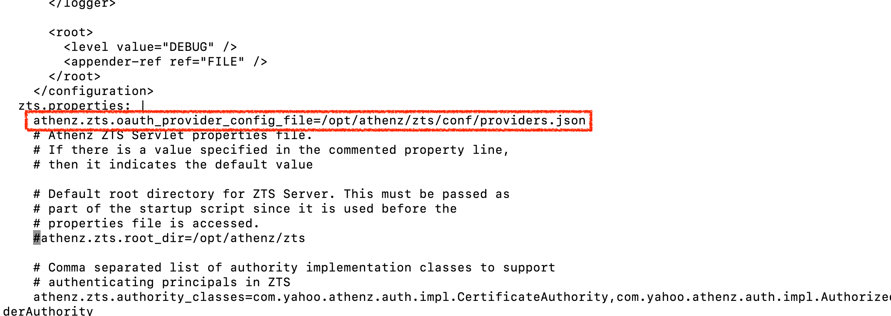

# keycloak-token-exchange-identity-provider-manifest

To mount this plugin as a jar for your Athenz ZTS, do the following

To create a jar plugin, do the following:

```sh
git clone git clone https://github.com/athenz-community/keycloak-token-exchange-identity-provider-manifest.git keycloak_jar
make -C keycloak_jar apply-plugin-patch
```

Then see if a jar `keycloak-token-provider.jar` is mounted:

```sh
kubectl -n athenz exec deployment/athenz-zts-server -c athenz-zts-server -- sh -c "ls -al /athenz/plugins"

# total 83164
# drwxrwxrwx 2 root root     4096 May  1 09:12 .
# drwxr-xr-x 3 root root     4096 May  1 09:12 ..
# -rw-r--r-- 1 root root 68546007 Apr  4 06:38 athenz-plugins.jar
# -rw-r--r-- 1 root root 16601716 May  1 09:12 keycloak-token-provider.jar
```

> [!NOTE]
> Make sure to have the `jwks_uri` fetchable from your server. you can always to `curl` inside your pod/server etc
> - Format found here: https://github.com/AthenZ/athenz/blob/master/servers/zts/src/test/resources/provider.config.json

Even if the jar is mounted on the Athenz server, the athenz does not use the jar file unless you let it know to trust it.

```sh
cat <<EOF | kubectl apply -f -
apiVersion: v1
kind: ConfigMap
metadata:
  name: zts-providers-config
  namespace: athenz
data:
  providers.json: |
    [
      {
        "issuerUri": "https://localhost:9089/realms/local-openwebui",
        "jwksUri": "http://host.docker.internal:9090/realms/local-openwebui/protocol/openid-connect/certs",
        "providerClassName": "com.mlajkim.athenz.KeycloakTokenProvider"
      }
    ]
EOF

# configmap/zts-providers-config created
```

Then let the ZTS server to mount the config created above:

```sh
make -C keycloak_jar apply-providers-config-patch
```

Then give setting

```sh
athenz.zts.oauth_provider_config_file=/opt/athenz/zts/conf/providers.json
```



Finally restart ZTS server:

```sh
kubectl -n athenz rollout restart deployment athenz-zts-server
```

# Docs

For more details, please refer to [docs](./docs/README.md).
